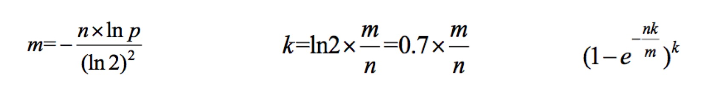

# 大数据题目

## 在40亿数据中统计出top10频率最高的字符串

哈希函数结果是均匀分布，并且同样的数字同样的结果。

使用数据流读取文件每次读取一行，对字符串使用哈希函数然后模100。按照计算结果分为100个文件存储。
然后单独计算每个文件中的top10，最后汇总计算出总的top10.

## 布隆过滤器

要允许有失误率（有过记录的一定能发现，但是没有记录的有可能错判），黑名单过滤系统应用。
给一个数据判断他是否在名单中（或者是否在这个文件系统中）使用布隆过滤器。
三个公式可以定量计算，还有需要定性分析。

m个位的bit的位图。使用K个哈希函数，一个文件K个结果所在位都涂黑。然后新来的数据做K个哈希结果如果都是黑的就判断在黑名单里面。
n个样本（样本个数），S字节（无关）。随着m增加，失误率p是下降的。m向上取整。p是失误率。k增加，失误率p先降低然后在增加。存在k有p极值。

详细的公式和计算逻辑

## 位图法查找43亿数字中没出现的，43亿是2的32次方个数字。

使用位图，43亿位bit换算是5亿多字节，500M搞定，数字出现就在这位标1没出现标0。最终打印标0的位数。

统计哪些出现了2次，2个bit来标记一个数，00没出现，01出现一次，10出现2次，11出现两次以上。1G空间可以算43亿数字。

空间限制特别小10M（3KB），只找一个没出现的。3KB处以4字节可以创建一个512长度的数组（取2的N次幂），然后将43亿数分成512个区间，统计区间词频。
每个区间词频放入数组，当数组中某一个区间小于应该出现的次数43亿除512，重复这个过程，最后能找到没出现的数。遍历文件次数log（512） 43亿 次数

如果用有限几个变量就使用二分法，每次取中点统计两边次数，小于应该的次数的区间继续进行二分。log2 N次的遍历次数。

分区间统计分段思想找中位数，512数组中从左向右加，看第几个结果刚好包括中位数，然后在这个区间继续分统计，一直到最后找到中位数。

二维大根堆，左右文件内部构成大根堆，然后每个大根堆的对顶构成一个大根堆。每取出一个对顶，文件内选出一个新的对顶，然后二维堆重新排序。

